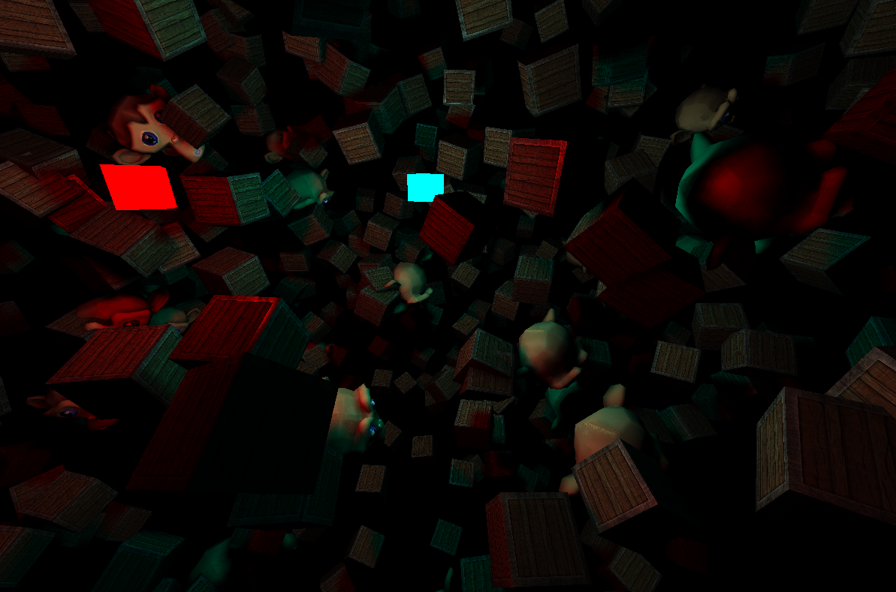

# OpenTK/OpenGL Renderer Demo

Игровой движок, написанный с использованием OpenTK. Имеется возможность использовать несколько шейдеров одновременно, загружать пользовательские модели в формате .obj.
Реализованы затенение по Фонгу, использование текстур и карты отражений, точечные источники света, тени от точечных источников света.

## Использованные библиотеки:
- OpenTK 4.9.4
- StbImageSharp 2.30.15
- Собрано под .NET 9.0

## Управление:
- W, A, S, D - движение камеры вперёд/назад, влево/вправо.
- Движение мышью - вращение камерой
- I, K, J, L, U, O - движение источниками света вперёд назад по оси X, Y, Z
- Esc - выход из программы